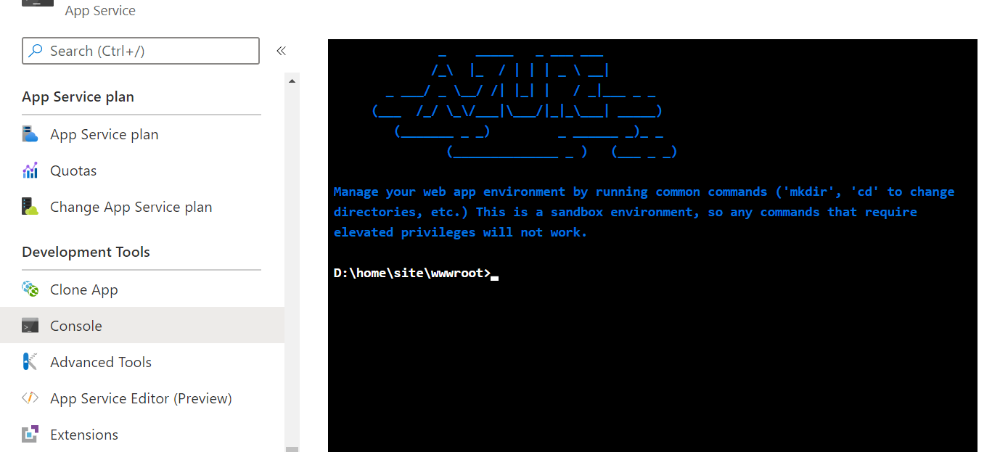
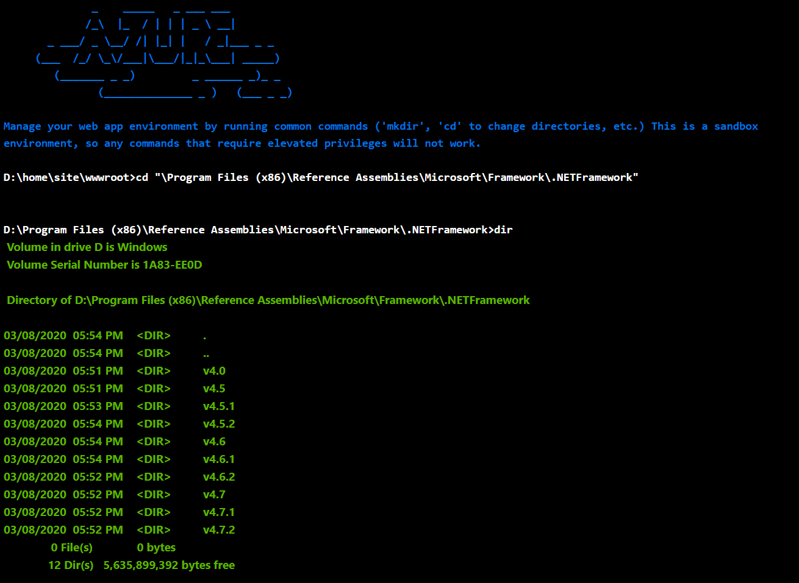

# .NET Framework 4.8 is coming to App Service
We are making an update to App Service to support .NET Framework 4.8. You will now be able to take advantage of the .NET Framework updated toolset and key improvements in the Runtime, Accesibility and Service Behavior enhancements just to name a few.  For the full list of updates and changes see the [announcement](https://devblogs.microsoft.com/dotnet/announcing-the-net-framework-4-8/).  The update is coming to App Service starting deployment in *July 14, 2020* and completing by *September 15, 2020*.  In preparation for your application update to .NET Framework 4.8 we recommend that you test your applications locally in advance to prepare.

## Preparing your site 
#### Testing your applications locally

[General Updates](https://devblogs.microsoft.com/dotnet/announcing-the-net-framework-4-8/)  
[Release Notes](https://github.com/microsoft/dotnet/blob/master/releases/net48/README.md)

1. Download .NET Framework 4.8 for your appropriate scenario [here](https://devblogs.microsoft.com/dotnet/announcing-the-net-framework-4-8/).
2. Update your application
3. Run it on local browsers

What will be affected? What to test for?

#### Confirming the update on App Service
To see if your apps have been updated after we begin the platform update, check which .NET Framework version is in use by using the **Console** feature under **Development Tools** in the App Service blade of your Azure Portal.

1. Run the following command: *cd "\Program Files (x86)\Reference Assemblies\Microsoft\Framework\.NETFramework"* .  

2. Run the *dir* command to list out the installed versions of .NET Framework.  

3. If .NET Framework 4.8 is installed, it will be located at *D:\Program Files (x86)\Reference Assemblies\Microsoft\Framework\.NETFramework\v4.8*

To track progress during the deployment, we will be posting periodic updates [here](https://github.com/Azure/app-service-announcements/issues/249).
